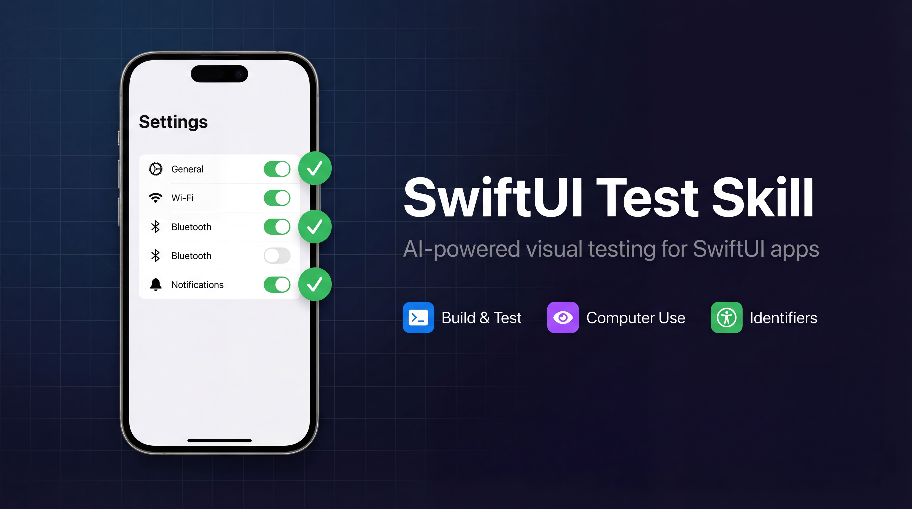

# SwiftUI Autotest Skill

Open-source Agent Skills for automated visual testing and accessibility setup of iOS/SwiftUI applications using Claude Code's computer use.

Build, launch in the Simulator, visually test every screen, detect crashes, analyze memory leaks, and add accessibility identifiers — all from the terminal, in a single command.

## Quick Start

Install both skills:

```bash
npx skills add https://github.com/yusufkaran/swiftui-autotest-skill
```

Then open your SwiftUI project in Claude Code and say:

> Use the /ios-test skill to build the app, launch it in the Simulator, and test all screens.

The agent will find your `.xcodeproj`, select a Simulator, build and install the app, navigate through every screen with computer use, screenshot each state, and produce a test report. No code is modified unless you explicitly approve changes.

## Why Visual Testing Matters

Unit tests verify logic. UI tests verify layouts, navigation, and user flows — but writing them takes time and maintaining them takes more. Computer use lets Claude **see and interact** with your app the way a real user would, without a single line of test code.

Accessibility identifiers make this faster and more reliable — and they also make your app work with VoiceOver, which is a requirement for many App Store categories.

## How It Works

```
/ios-test                          /add-accessibility
   │                                      │
   ├─ Find .xcodeproj/.xcworkspace        ├─ Scan all SwiftUI files
   ├─ Select Simulator (smart logic)      ├─ Find interactive elements
   ├─ Build with xcodebuild               ├─ Skip elements that already
   ├─ Install & launch app                │  have identifiers
   ├─ Computer use: navigate & test       ├─ Generate {screen}-{type}-{name}
   ├─ Screenshot each screen              ├─ Add .accessibilityIdentifier()
   ├─ Check crash logs                    ├─ Flag Dynamic Type issues
   ├─ (optional) State testing            └─ Summary report
   ├─ (optional) Performance analysis
   └─ Test report
```

The recommended workflow: run `/add-accessibility` first to make your views identifiable, then run `/ios-test` to test them.

## What It Checks

| Check | What the agent looks for |
|-------|--------------------------|
| **Screen rendering** | Layout overflow, overlapping views, empty areas, truncated text |
| **Navigation** | Every TabView tab, every NavigationLink, back navigation |
| **Interactive elements** | Buttons respond to taps, toggles switch, sliders move |
| **Crash detection** | Simulator crash logs analyzed with stack traces and source references |
| **Empty state** | Meaningful message shown when no data is available |
| **Error state** | Clear error message with retry option |
| **Loading state** | Loading indicator visible, UI not frozen |
| **Memory usage** | RAM footprint per screen, before/after comparison on navigation |
| **Memory leaks** | `leaks` command on running process, retain cycle detection |
| **Accessibility gaps** | Missing identifiers on Button, TextField, Image, Toggle, Picker, etc. |
| **Dynamic Type** | Missing `lineLimit`, `minimumScaleFactor`, hardcoded font sizes |

## Included Skills

| Skill | Command | Purpose |
|-------|---------|---------|
| **iOS Test** | `/ios-test` | Build, launch, visually test with computer use, crash logs, state testing, performance analysis |
| **Add Accessibility** | `/add-accessibility` | Scan SwiftUI views and add `{screen}-{type}-{name}` accessibility identifiers |

## Usage

### /ios-test

```bash
# Test all screens (default)
/ios-test

# Test a specific user flow
/ios-test --flow=onboarding

# Test a specific screen
/ios-test --screen=LoginView

# Choose a Simulator device
/ios-test --device="iPhone 16"

# Specify Xcode scheme
/ios-test --scheme=MyApp

# Test empty, error, and loading states via launch arguments
/ios-test --states

# Measure RAM per screen and check for memory leaks
/ios-test --performance

# Screenshot every step
/ios-test --screenshot-all

# Combine options
/ios-test --flow=checkout --states --performance --screenshot-all
```

**Simulator selection** is automatic:
- One booted Simulator → uses it directly, no questions asked
- Multiple booted → lists them and asks which one to use
- None booted → suggests the most recent iPhone device, asks for confirmation

**Natural language** also works — just say "test the app", "run it in the Simulator", "check for crashes", or "test the onboarding flow".

### /add-accessibility

```bash
# Scan entire project and add identifiers
/add-accessibility

# Preview changes without modifying files
/add-accessibility --dry-run

# Scan a specific directory
/add-accessibility --path=Sources/Features/Login

# Verbose output for each identifier added
/add-accessibility --verbose
```

**Natural language** also works — "add accessibility identifiers", "make views testable", "add VoiceOver support".

#### Naming Convention

All identifiers follow `{screen}-{type}-{name}`:

| Source | Generated Identifier |
|--------|---------------------|
| `LoginView.swift` → `Button("Continue")` | `login-button-continue` |
| `LoginView.swift` → `TextField("Email")` | `login-textfield-email` |
| `LoginView.swift` → `SecureField("Password")` | `login-securefield-password` |
| `SettingsView.swift` → `Toggle("Notifications")` | `settings-toggle-notifications` |
| `HomeView.swift` → `Image(systemName: "gear")` | `home-image-gear` |
| `ProfileView.swift` → `HStack { }.onTapGesture` | `profile-tap-user-row` |

Screen name is derived from the filename (`LoginView.swift` → `login`). Elements that already have identifiers are skipped — existing code is never modified.

## Installation

### Option A: Using skills.sh (recommended)

```bash
npx skills add https://github.com/yusufkaran/swiftui-autotest-skill
```

During installation, choose your preferred scope:

| Scope | Where it's installed | Who can use it | Shared via git |
|-------|---------------------|----------------|----------------|
| **User** | `~/.claude/commands/` | You, in all projects | No |
| **Project** | `.claude/commands/` | Everyone who clones the repo | Yes |
| **Local** | `.claude/commands/` (gitignored) | You, in this project only | No |

### Option B: Claude Code Plugin

1. Add the marketplace:

```bash
/plugin marketplace add yusufkaran/swiftui-autotest-skill
```

2. Install the plugin:

```bash
/plugin install swiftui-autotest-skill@swiftui-autotest-skill
```

To enable for everyone in a repository, add to `.claude/settings.json`:

```json
{
  "enabledPlugins": {
    "swiftui-autotest-skill@swiftui-autotest-skill": true
  },
  "extraKnownMarketplaces": {
    "swiftui-autotest-skill": {
      "source": {
        "source": "github",
        "repo": "yusufkaran/swiftui-autotest-skill"
      }
    }
  }
}
```

When team members open the project, Claude Code will prompt them to install the skill.

### Option C: Manual Install

```bash
git clone https://github.com/yusufkaran/swiftui-autotest-skill.git
```

Copy files based on your preferred scope:

```bash
# User scope — available in all your projects
cp swiftui-autotest-skill/commands/*.md ~/.claude/commands/

# Project scope — shared with your team via git
mkdir -p .claude/commands
cp swiftui-autotest-skill/commands/*.md .claude/commands/

# Local scope — this project only, not committed
mkdir -p .claude/commands
cp swiftui-autotest-skill/commands/*.md .claude/commands/
echo ".claude/commands/ios-test.md" >> .gitignore
echo ".claude/commands/add-accessibility.md" >> .gitignore
```

## Requirements

### /ios-test
- macOS
- Xcode + iOS Simulator
- Claude Code v2.1.85+ (computer use support)
- Pro or Max plan (required for computer use)
- `computer-use` MCP server enabled (run `/mcp` to enable)

### /add-accessibility
- Any SwiftUI project (no additional dependencies)

## Skill Structure

```text
swiftui-autotest-skill/
  README.md
  LICENSE
  .claude-plugin/
    plugin.json
    marketplace.json
  commands/                          ← Claude Code native format
    ios-test.md
    add-accessibility.md
  skills/                            ← skills.sh / npx format
    ios-test/
      SKILL.md
    add-accessibility/
      SKILL.md
```

## Who This Is For

- iOS developers who want to test their SwiftUI apps visually without writing XCUITest
- Solo developers who don't have a QA team
- Teams that want consistent, repeatable test runs across projects
- Developers preparing for App Store review and need accessibility compliance
- Anyone who wants to catch layout bugs, crashes, and memory leaks before users do

## Which Scope Should I Choose?

| Situation | Recommended Scope |
|-----------|------------------|
| Personal use across all my projects | **User** |
| Entire team should use it, commit to repo | **Project** |
| Trying it out, don't want to affect the repo | **Local** |
| Open-source project, contributors should have it | **Project** |

## Contributing

Contributions are welcome! Open an issue or submit a pull request.

## License

This project is available under the MIT License. See [LICENSE](LICENSE) for details.
